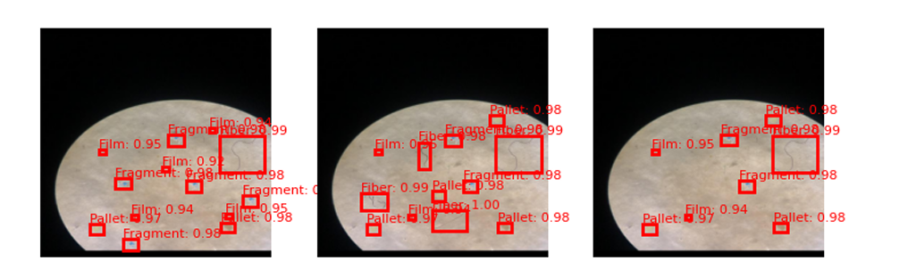

# 🔬 FasterResFPN: Deep Learning for Automated Microplastic Detection in Aquatic Environments

FasterResFPN is an end-to-end, deep learning–based object detection system engineered to enable large-scale microplastic surveillance in natural waters. Built upon Faster R-CNN with a ResNet-50 + Feature Pyramid Network (FPN) backbone, it leverages multi-scale feature learning to classify and localize four major categories of microplastic particles: fibers, fragments, pellets, and films.

Trained on the Microplastic-100 dataset, the system achieves state-of-the-art recall while maintaining competitive precision, making it a strong alternative to costly and time-consuming laboratory techniques such as FTIR and Raman spectroscopy.

## 📊 Example Detections

  

Examples of four microplastic types detected : fibers, fragments, pellets, and films.
## 🚀 Why FasterResFPN?
Traditional microplastic detection relies on spectroscopy or manual microscopy, both of which are resource-intensive, slow, and impractical for large-scale monitoring. These methods also demand specialized equipment and expertise, limiting their accessibility in field applications. FasterResFPN, by contrast, applies two-stage deep detection to overcome real-world challenges like turbidity, lighting variation, and background clutter. By leveraging a ResNet-50 backbone with a Feature Pyramid Network (FPN), it captures both fine-grained details and high-level semantic features, making it effective across particle sizes—from large fragments and pellets to tiny, low-contrast fibers and thin films. Trained with diverse augmentations on the dataset, FasterResFPN achieves strong recall and accuracy, offering a scalable, automated alternative for environmental monitoring.

## 🏗️ Model Pipeline

1. **Backbone (ResNet-50 + FPN)**  
   - Extracts multi-scale features (P2–P5), capturing fine details (thin films) and broader context (fragments/pellets).

2. **Region Proposal Network (RPN)**  
   - Generates candidate bounding boxes using anchors, optimized with classification + regression loss.

3. **ROI Align**  
   - Preserves fine-grained details via bilinear interpolation for precise microplastic localization.

4. **Fast R-CNN Head**  
   - Performs **classification** into 4 classes and **bounding box refinement** for final predictions.

## 📈 Results

- **F1 Score**: 0.912  
- **mAP@0.5**: 0.901  
- **Recall**: 0.948 (best among tested baselines)  

**Comparison**:  
Outperforms **YOLOv7–YOLOv9** in recall, ensuring fewer missed microplastics.

**Per-class Performance**:  
- **Fibers**: Strongest performance (F1 > 0.98)  
- **Fragments & Pellets**: Balanced detection accuracy  
- **Films**: Weaker localization due to translucency and amorphous boundaries (dominant failure mode)  

